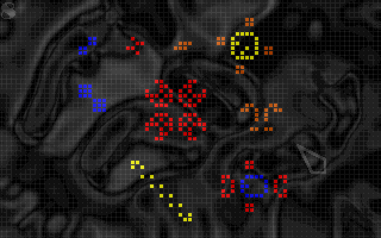

# cella
Un automate cellulaire programmable

## Qu'est-ce que c'est?

Un automate cellulaire est une structure régulière constituée de "cellules". Chaque cellule a un état et peut évoluer dans le temps. L'état d'une cellule à une génération donnée est déterminé par son état et l'état de ses voisines à la génération précédente en appliquant un jeu de règles.

L'exemple le plus connu d'automate cellulaire est [le jeu de la vie](https://fr.wikipedia.org/wiki/Jeu_de_la_vie). Il s'agit d'un automate à 2 dimensions ne comportant que 4 règles pour 2 états (vivant/mort) :
- Une cellule vide avec exactement 3 voisines donne lieu à une naissance à la génération suivante
- Une cellule avec exactement deux voisines vivantes conserve son état à la génération suivante
- Une cellule avec plus de 3 voisines meurt de suprpopulation à la génération suivante
- Une cellule avec moins de 2 voisines meurt d'isolement à la génération suivante
Ces règles très simples permettent de générer une grande variété de structures.

De nombreux logiciels offrent des fonctionnalités similaires ou plus avancées. L'un des plus connus -centré sur le jeu de la vie, mais très complet- est [Golly](http://golly.sourceforge.net/).

## Historique

La version originale de Cella a été développée en 1999 en [Turbo C](https://fr.wikipedia.org/wiki/Turbo_C). 



Un binaire x86 est [toujours disponible](http://glenn.sanson.free.fr/v2/content_files/cella.zip), mais le code source est définitivement perdu. 

Cette version reprend le format de règles de la version originale.

## Installation

- Construction

```
npm i

webpack
```

- Utilisation

Les fichiers générés (répertoire ```/dist```) sont directement exploitables.

## Changelog

### 0.0.1 - 2018.07.29

Première version

- Contrôles limités
- Règles du jeu de la vie codées en dur

